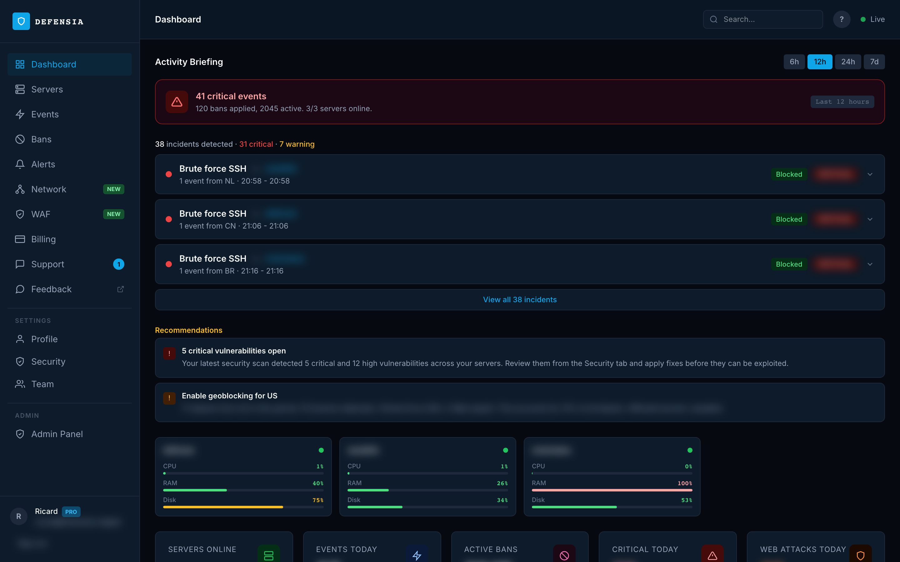
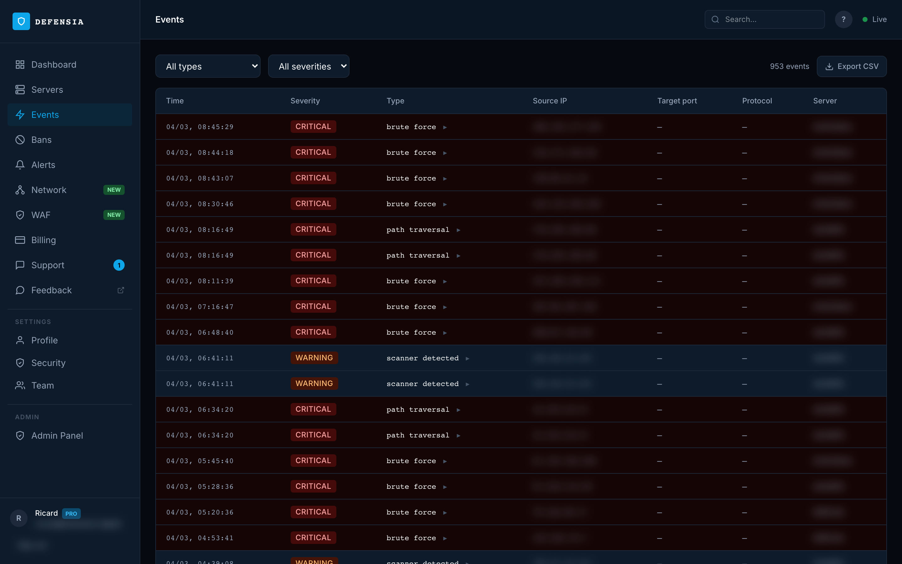
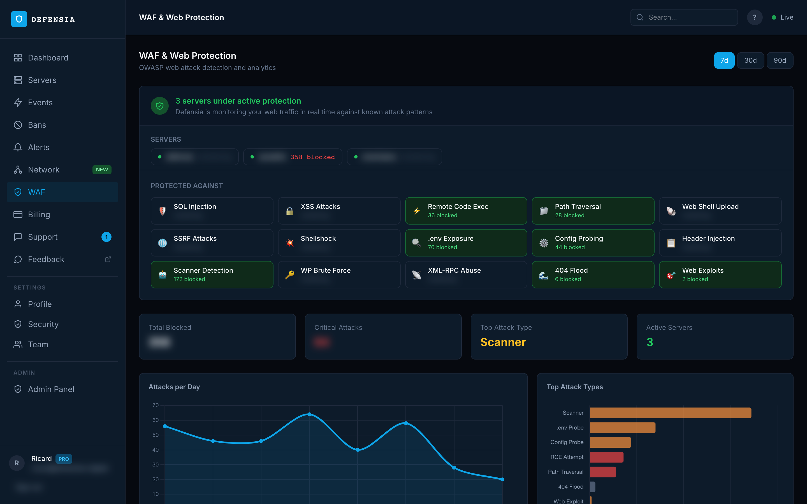

# Defensia Agent

[](https://opensource.org/licenses/MIT)
[](https://go.dev)
[](https://github.com/defensia/agent)
[](https://github.com/defensia/agent/releases)
[](https://github.com/defensia/agent/pkgs/container/agent)
[](https://defensia.cloud)
[](https://marketplace.digitalocean.com/apps/defensia-agent)

**Your server is being attacked right now. You just don't know it.**

The average Linux VPS receives its first automated attack within 4 minutes of going online — SSH brute force, port scans, web exploits. Most developers find out when it's already too late.

Defensia is a lightweight Go agent that detects every attack in real time and blocks them automatically. One command to install, zero configuration.

```bash
curl -fsSL https://defensia.cloud/install.sh | sudo bash -s -- --token <YOUR_TOKEN>
```

**Or with Docker:**

```bash
docker run -d --privileged --net=host --pid=host \
  -v /var/log:/var/log:ro \
  -v /var/run/docker.sock:/var/run/docker.sock:ro \
  -e DEFENSIA_TOKEN=<YOUR_TOKEN> \
  ghcr.io/defensia/agent:latest
```

→ **[Get your token at defensia.cloud](https://defensia.cloud)**
→ First attack visible in your dashboard in under 15 minutes.

---

## Why Defensia

| | fail2ban | CrowdSec | Defensia |
|--|---------|---------|---------|
| Real-time dashboard | ❌ | Partial | ✅ |
| One-command install | ❌ | ❌ | ✅ |
| SSH detection (15 patterns) | ✅ | ✅ | ✅ |
| WAF (15 OWASP types) | ❌ | Partial | ✅ |
| Bot management (70+ fingerprints) | ❌ | ❌ | ✅ |
| Monitor mode (detect without blocking) | ❌ | ❌ | ✅ |
| Network ban sharing | ❌ | ✅ | ✅ |
| Zero configuration | ❌ | ❌ | ✅ |
| Community hub required | ❌ | ✅ | ❌ |

- **fail2ban** blocks after the fact. Defensia shows you while it's happening.
- **CrowdSec** requires a community hub and complex setup. Defensia is one agent, one dashboard.
- You'll see your first blocked attack within 15 minutes of installing.

---

## Dashboard



<details>
<summary>Events feed & WAF analytics</summary>




</details>

---

## What it detects

**SSH & brute force** — 15 detection patterns covering auth failures, pre-auth scanning, protocol mismatches, PAM failures, and kex negotiation drops. Patterns are synced from the dashboard and can be enabled/disabled per server.

**Web Application Firewall (WAF)** — 15 OWASP attack types across Nginx/Apache logs:

| Attack type | Default score | Mode |
|-------------|:---:|------|
| RCE / Web shell / Shellshock | +50 | Score-based |
| Scanner User-Agent (sqlmap, nikto, nmap...) | +50 | Score-based |
| SQL injection / SSRF / Web exploit | +40 | Score-based |
| Honeypot trap | +40 | Score-based |
| Path traversal / Header injection | +30 | Score-based |
| WordPress brute force | +30 | Threshold (10 req / 2 min) |
| XSS / `.env` probe / XMLRPC | +25 | Score-based |
| Config probing / Scanner pattern | +20 | Score-based |
| 404 flood | +15 | Threshold (30 req / 5 min) |

**Bot Scoring Engine** — each detection adds points to a per-IP score. Scores decay at 5 pts/min when idle. Thresholds: observe (30) → throttle (60) → block/1h (80) → blacklist/24h (100+). Score weights are configurable per server from the dashboard.

**Bot Management** — 70+ bot fingerprints (search engines, AI crawlers, SEO tools, scanners, monitoring). Per-org policies: allow/log/block per fingerprint. Allowed bots (Googlebot, Bingbot) are tracked as events without blocking. Bots with policy **block** are rejected at the web server level (nginx `map+include` / Apache `SetEnvIfNoCase`) — connection closed before PHP/app is ever reached.

**Monitor Mode** — new servers start in monitor mode by default: all threats are detected and reported to the dashboard, but no IPs are banned. Switch to enforcement mode when ready.

**Dynamic Detection Rules** — SSH detection patterns are synced from the dashboard and compiled at runtime. Enable/disable individual rules per server without agent updates.

**Docker-aware** — auto-detects web servers inside Docker containers, reads logs via bind mounts, volumes, or container stdout

**GeoIP blocking** — block entire countries from the dashboard
**Network propagation** — bans detected on one server instantly applied to all your servers
**Security scanner** — detects vulnerable software versions and misconfigurations
**System metrics** — CPU, memory, disk, network reported to the dashboard

---

## Install

### One-liner (recommended)

```bash
curl -fsSL https://defensia.cloud/install.sh | sudo bash -s -- --token <YOUR_TOKEN>
```

**Supported systems:** Ubuntu 20+, Debian 11+, CentOS 7+, RHEL 8+, Amazon Linux 2023
**Requirements:** `iptables`, `systemd` (or upstart/sysvinit), root access
**Recommended:** `ipset` (auto-detected — increases ban capacity from 500 to 65,000+)

### Docker

```bash
docker run -d --privileged --net=host --pid=host \
  -v /var/log:/var/log:ro \
  -v /var/run/docker.sock:/var/run/docker.sock:ro \
  -v defensia-config:/etc/defensia \
  -e DEFENSIA_TOKEN=<YOUR_TOKEN> \
  --name defensia-agent \
  --restart unless-stopped \
  ghcr.io/defensia/agent:latest
```

Or add to your existing `docker-compose.yml`:

```yaml
services:
  defensia-agent:
    image: ghcr.io/defensia/agent:latest
    container_name: defensia-agent
    restart: unless-stopped
    privileged: true
    network_mode: host
    pid: host
    environment:
      - DEFENSIA_TOKEN=${DEFENSIA_TOKEN}
    volumes:
      - /var/log:/var/log:ro
      - /var/run/docker.sock:/var/run/docker.sock:ro
      - defensia-config:/etc/defensia

volumes:
  defensia-config:
```

```bash
DEFENSIA_TOKEN=<YOUR_TOKEN> docker compose up -d defensia-agent
```

The agent auto-registers on first start and persists its config in the `defensia-config` volume. Subsequent restarts don't need the token.

**Image:** `ghcr.io/defensia/agent` — multi-arch (amd64 + arm64), ~40MB

### Uninstall

```bash
curl -fsSL https://defensia.cloud/install.sh | sudo bash -s -- --uninstall
```

---

## How it works

```
auth.log / web access logs / Docker container logs
    │
    ▼
Log auto-detection
    │  nginx -T / apachectl -S / docker inspect / docker logs
    │  Resolves bind mounts, volumes, symlinks, relative paths
    ▼
Watcher goroutines
    │  Detect brute force, SQLi, XSS, SSRF, path traversal, web shells...
    ▼
Bot Scoring Engine
    │  Each detection adds points to per-IP score (decay: -5 pts/min)
    │  Score weights configurable per server from dashboard
    │
    ├─ < 30 pts  → observe (log only)
    ├─ ≥ 30 pts  → throttle
    ├─ ≥ 80 pts  → block 1h
    └─ ≥ 100 pts → blacklist 24h
            │
            ▼
    BanIP → ipset add defensia-bans <IP>
            │  Falls back to iptables -I INPUT -s <IP> -j DROP
            │  ipset: 65K+ IPs  ·  iptables fallback: 500 (FIFO rotation)
            │
            ├──► POST /api/v1/agent/bans → dashboard + propagates to all servers
            │
            └──► WebSocket receives ban.created from other servers → BanIP
```

The agent never bans reserved IPs (`127.x`, `10.x`, `192.168.x`), your own server's IPs, or the Defensia API endpoint — even if the backend somehow sends a bad rule. Bans use `ipset` when available (65K+ capacity); without it, falls back to iptables with automatic FIFO rotation at 500 rules.

---

## Per-server WAF configuration *(v0.9.3+)*

Each attack type can be independently configured from the dashboard (Server → Web Protection). Changes sync within 60 seconds.

- **Enable/disable types** — disable rules irrelevant to your stack (e.g. `wp_bruteforce` on a non-WordPress server)
- **Detect-only mode** — record events without banning. Useful for audit-only policies or testing before enforcement
- **Custom thresholds** — override defaults for `wp_bruteforce`, `xmlrpc_abuse`, `scanner_detected`, `404_flood`
- **Custom score weights** *(v0.9.34+)* — adjust points per detection type. E.g. set `404_flood` to 0 to ignore in scoring, or increase `sql_injection` to 80 for instant blocking on first detection

`null` WAF config → all 15 types active, default thresholds and score weights (fully backward compatible).

---

## SSH detection rules *(v0.9.44+)*

The agent ships with 15 built-in SSH detection patterns covering:

| Category | Patterns | Examples |
|----------|:--------:|---------|
| Auth failures | 9 | Failed password, Invalid user, PAM auth failure, Max auth attempts, Root login refused |
| Pre-auth scanning | 6 | No identification string, Bad protocol version, Unable to negotiate, Connection closed/reset preauth, Timeout before auth |

All patterns are visible and configurable from the dashboard (Server → SSH Protection → Detection Rules). Disable individual rules per server without restarting the agent — changes sync via the heartbeat.

---

## Docker support *(v0.9.20+)*

The agent **automatically detects Docker** and reports all running containers to the dashboard. Web containers (nginx, apache, caddy, or any container exposing ports 80/443/8080) get special treatment:

1. Runs `nginx -T` or `apachectl -S` **inside** the container to discover log paths and domain names
2. Maps container log paths to host paths via bind mounts and Docker volumes
3. Falls back to scanning mount directories for `*access*.log` files
4. Last resort: reads container stdout via `docker logs -f` if logs go to stdout (common with official nginx image)

### Docker labels *(v0.9.62+)*

Use Docker labels to configure monitoring per container — no agent restart needed:

```yaml
services:
  nginx:
    image: nginx
    labels:
      defensia.monitor: "true"          # force-monitor (even non-web images)
      defensia.log-path: "/var/log/nginx/access.log"  # explicit host log path
      defensia.domain: "example.com,api.example.com"   # associate domains
      defensia.waf: "true"              # informational (WAF config from panel)
    volumes:
      - /var/log/nginx:/var/log/nginx

  my-custom-app:
    image: myapp:latest
    labels:
      defensia.monitor: "true"          # monitor even though not a web keyword image
      defensia.log-path: "/var/log/myapp/access.log"

  internal-nginx:
    image: nginx
    labels:
      defensia.monitor: "false"         # skip this container
```

| Label | Values | Effect |
|-------|--------|--------|
| `defensia.monitor` | `true` / `false` | Force-include or exclude a container from monitoring |
| `defensia.log-path` | Host path(s), comma-separated | Explicit log path — skips auto-detection |
| `defensia.domain` | Domain(s), comma-separated | Associate domain names with this container's logs |
| `defensia.waf` | `true` / `false` | Informational — WAF on/off is controlled from the panel |

**Priority**: `defensia.log-path` label > `nginx -T` auto-detection > bind-mount scan.
**Without labels**: the agent falls back to image-name detection (same as before).

**Dashboard** — the server detail page shows a dedicated Docker tab with all containers, web detection status, and the WAF tab shows which log sources are being monitored.

```bash
journalctl -u defensia-agent | grep webwatcher
# [webwatcher] docker: container my-custom-app selected via defensia.monitor label
# [webwatcher] docker: watching /var/log/myapp/access.log from container my-custom-app (defensia.log-path label)
# [webwatcher] docker: watching /var/log/nginx/access.log from container nginx
# [webwatcher] detected 3 access log(s), 5 domain(s)
```

---

## Manual log path configuration

If auto-detection doesn't find your logs (custom paths, piped logs, non-standard setups), set the `WEB_LOG_PATH` environment variable:

```bash
sudo systemctl edit defensia-agent
```

Add:

```ini
[Service]
Environment="WEB_LOG_PATH=/var/log/httpd/access_log,/var/log/nginx/custom-access.log"
```

Then restart:

```bash
sudo systemctl restart defensia-agent
```

`WEB_LOG_PATH` overrides all auto-detection. Multiple paths are comma-separated.

---

## FAQ

### `"Peer's Certificate issuer is not recognized"` during install

Affects CentOS 7, RHEL 7, and systems with `ca-certificates` not updated since 2024.

```bash
curl -sk https://letsencrypt.org/certs/isrgrootx1.pem \
  -o /tmp/isrg-root-x1.pem
export CURL_CA_BUNDLE=/tmp/isrg-root-x1.pem
curl -fsSL https://defensia.cloud/install.sh | bash -s -- --token <YOUR_TOKEN>
```

### Agent shows `203/EXEC` in the dashboard

Binary missing or not executable. Restore from backup:

```bash
cp /usr/local/bin/defensia-agent.bak /usr/local/bin/defensia-agent
chmod 755 /usr/local/bin/defensia-agent
systemctl reset-failed defensia-agent && systemctl start defensia-agent
```

If `systemctl start` fails with `start-limit-hit`:

```bash
grep -q StartLimitIntervalSec /etc/systemd/system/defensia-agent.service || \
  sed -i '/^\[Unit\]/a StartLimitIntervalSec=0' /etc/systemd/system/defensia-agent.service
systemctl daemon-reload && systemctl reset-failed defensia-agent && systemctl start defensia-agent
```

---

## Changelog

| Version | Changes |
|---------|---------|
| v0.9.62 | **Docker labels autoconf**: `defensia.monitor`, `defensia.log-path`, `defensia.domain`, `defensia.waf` — configure monitoring per container via Docker labels without agent restart |
| v0.9.61 | **Docker image published to GHCR** (`ghcr.io/defensia/agent`): multi-arch (amd64+arm64), auto-register via `DEFENSIA_TOKEN` env var, docker-compose snippet included. Automated build+push on every release tag |
| v0.9.60 | Apply threat feed (Spamhaus DROP/EDROP, Feodo Tracker, CINS Army) to firewall — pre-emptive blocking of known-bad IPs |
| v0.9.59 | Virtual patching: apply dynamic WAF rules from panel (regex patterns synced via heartbeat) |
| v0.9.58 | Heartbeat reports `auth_watcher_method`, `firewall_mode`, `ban_capacity`, `active_bans_count` for dashboard visibility |
| v0.9.57 | Fix: web log detection for Docker containers with non-standard log paths; improved Apache log discovery on cPanel servers |
| v0.9.56 | Agent reports all bot actions (allow/log/block) as events for full dashboard visibility |
| v0.9.55 | UA bot blocking at the web server level: bots with policy **block** are rejected by nginx (`map+include /etc/defensia/ua-blocklist.conf`) or Apache (`SetEnvIfNoCase`) — zero app load, graceful reload on every policy change |
| v0.9.54 | Emit `bot_unknown` events for unrecognized bot User-Agents (not in fingerprint list) — surfaces unknown crawlers in the dashboard |
| v0.9.53 | Restore ipset firewall backend: `defensia-bans` hash:ip set (65K capacity), automatic FIFO rotation at 500 bans when ipset absent, migrates existing DROP rules on first run |
| v0.9.52 | Skip private/reserved IPs (Docker bridge, localhost) in both SSH and WAF watchers — no more noise from `172.20.0.1` |
| v0.9.51 | Fix: deduplicate WAF scoring when same request appears in multiple log files |
| v0.9.50 | Cumulative per-IP WAF scoring engine with configurable weights |
| v0.9.49 | Fix: check WAF patterns against both raw and decoded URI to catch encoded attacks; private IP filter |
| v0.9.47 | Fix: connect WAF config from panel sync to web watcher — WAF detection was completely disabled |
| v0.9.46 | Fix: remove duplicate EventFunc declaration |
| v0.9.45 | User-Agent `DefensiaAgent/{version}` header; allowed bots reported as `bot_crawl` events |
| v0.9.44 | Dynamic detection rules from panel sync — SSH patterns configurable per server from dashboard |
| v0.9.43 | Expanded SSH detection: 15 patterns (9 auth failures + 6 pre-auth scanning) |
| v0.9.42 | Monitor mode: detect threats without blocking; new servers default to monitor mode |
| v0.9.41 | Bot fingerprint detection with pre-filter gate before WAF scoring |
| v0.9.40 | Bot management: allow/log/block policies per fingerprint, synced from panel |
| v0.9.39 | Regex support for dynamic WAF rules (OWASP CRS compatible) |
| v0.9.38 | Fix: nil pointer crash in `syncAndApply` when WAF disabled and BotFingerprints non-empty |
| v0.9.37 | Dynamic WAF rules synced from panel (Phase 1) |
| v0.9.35 | Bot scoring engine replaced malware detection; per-IP cumulative scoring with decay |
| v0.9.34 | Configurable score weights per server via WAF config from dashboard |
| v0.9.33 | ipset firewall backend (65K+ ban capacity) with iptables FIFO fallback (500 bans, auto-rotation); startup trim for existing rules exceeding capacity |
| v0.9.32 | Malware detection expansion: cryptominers, rootkits, web shells (60+ signatures) |
| v0.9.31 | Bot scoring engine: per-IP cumulative scoring with decay, 4 action levels (observe/throttle/block/blacklist), category classification |
| v0.9.30 | File integrity monitoring, port scan detection, SYN flood monitoring |
| v0.9.29 | Fix: auto-update download URL constructed from target_version (prevents update loop) |
| v0.9.28 | Honeypot trap detection (50+ decoy endpoints) |
| v0.9.27 | Security scanner: 30+ hardening checks (SSH, web server, file permissions, CVEs) |
| v0.9.26 | Auto-remediation: agent can fix 12 security findings on demand from dashboard |
| v0.9.25 | Timed bans via iptables with auto-expiry; ban duration from WAF score action |
| v0.9.24 | CloudLinux/cPanel: cPHulk SQLite polling, journald fallback, extended SSH regex |
| v0.9.23 | Fix: nginx global `access_log` with `server_name` in server blocks now correctly associates domains with log paths |
| v0.9.22 | Improved Apache detection for CentOS/RHEL: ServerRoot resolution, symlink following, `apachectl -S` discovery, well-known RHEL paths fallback |
| v0.9.21 | Fix: web container detection matches container port (`->80/tcp`) not host port (`:80->`) |
| v0.9.20 | Docker container detection, stdout log reader, Docker info in heartbeat, bind mount + volume log discovery |
| v0.9.19 | Whitelisted IPs are detected (events reported) but never banned |
| v0.9.18 | Raw access log line included in event details for attack evidence |
| v0.9.17 | Fix: Apache `${APACHE_LOG_DIR}` resolution, monitored domains/log paths reported in heartbeat |
| v0.9.16 | Instant whitelist propagation via `sync.requested` WebSocket event |
| v0.9.15 | Fix: false rollback on `"signal: terminated"` — systemd kills the calling process on restart, now correctly treated as success |
| v0.9.14 | Fix: removed `updateServiceFile()` from updater — caused a regression loop on every update |
| v0.9.13 | Fix: `StartLimitIntervalSec=0` moved to `[Unit]` section to prevent start-limit-hit |
| v0.9.12 | Improved updater diagnostics; `recent_logs` in failure event payloads |
| v0.9.10 | Fix: health-check window extended; stale ban cleanup on sync |
| v0.9.9 | Fix: cross-device rename failure in updater |
| v0.9.8 | Fix: preflight check uses `check` subcommand; atomic rollback |
| v0.9.7 | Docker container log detection via bind-mounts |
| v0.9.6 | Added `web_exploit` detection (Spring4Shell, Log4Shell, Struts OGNL...) |
| v0.9.5 | Atomic binary replacement + 15s post-restart health check; rollback on crash |
| v0.9.3 | Per-server WAF config: enable/disable types, detect-only mode, custom thresholds |
| v0.9.2 | XSS, SSRF, web shell, header injection detection |
| v0.9.0 | Initial WAF: SQLi, path traversal, RCE, shellshock, env/config probe, wp_bruteforce, xmlrpc, 404_flood, scanner |
| v0.6.x | Brute-force detection, GeoIP, zombie processes, auto-update, IP safety |

---

## License

MIT — see [LICENSE](LICENSE)
